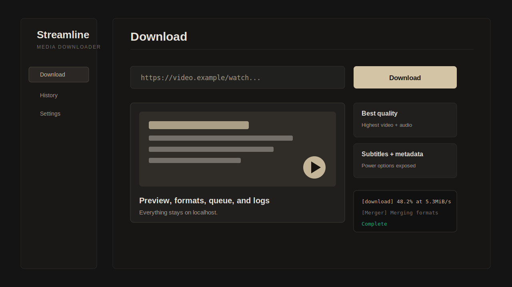

<div align="center">
  

  # Streamline
  **A beautiful, open-source WebUI for yt-dlp**

  Download videos and audio from 1000+ platforms — YouTube, TikTok, Instagram, Twitter/X, Facebook, and more.

  
  
  

  
</div>

---

## ✨ Features

- **1000+ supported platforms** via yt-dlp — YouTube, TikTok, Instagram, Twitter/X, SoundCloud, Bandcamp, and hundreds more
- **Format picker** — choose resolution (4K, 1080p, 720p, 480p) or audio-only; defaults to best MP4
- **Download queue** — sequential queue with drag-to-reorder, pause/resume, and retry
- **Live logs** — real-time yt-dlp stdout/stderr streamed to the terminal panel via WebSocket
- **Download history** — persistent log of all past downloads with file-open shortcut
- **Playlist support** — bulk-select individual playlist entries before downloading
- **Advanced options** — subtitles, thumbnails, metadata embedding, SponsorBlock, rate limiting, custom yt-dlp flags
- **Cookie authentication** — upload browser cookies for age-restricted or members-only content
- **Dark & light theme** — toggle in the sidebar; preference persisted to localStorage
- **Desktop notifications** — browser notifications on download complete

---

## 🚀 Quick Start

### Prerequisites

| Tool | Version | Notes |
|------|---------|-------|
| [Bun](https://bun.sh) | >= 1.1 | JavaScript runtime + package manager |
| Python | >= 3.9 | Required for yt-dlp |
| yt-dlp | latest | Auto-installed on first run |
| ffmpeg | any | Auto-installed via npm package |

### Install & Run

```bash
# Install (downloads yt-dlp and ffmpeg automatically)
npx streamline

# Or install globally:
npm install -g streamline
streamline
```

The app opens at **http://localhost:7979**

### Development Mode

```bash
git clone https://github.com/flameonlabs/streamline
cd streamline
bun install
bun run dev
```

- Frontend: http://localhost:5173
- Backend: http://localhost:7979
- WebSocket: ws://localhost:7979/ws

---

## 🖥️ Usage

1. **Paste a URL** into the input bar — metadata is fetched automatically
2. **Pick a format** in the right panel (defaults to best MP4)
3. **Click Download** — the video moves to the queue immediately
4. **Watch progress** in the Queue panel and live yt-dlp output in the Logs panel
5. **Open the file** when complete using the folder icon

### Batch Downloads

Click **Batch** next to the URL bar, paste multiple URLs (one per line or comma-separated), then click **Download All**.

### Playlists

Paste a playlist URL — Streamline detects it automatically and shows a checklist. Select individual entries, then click **Download Selected**.

---

## ⚙️ Settings

### General

| Setting | Default | Description |
| --- | --- | --- |
| Output folder | `~/Downloads/Streamline` | Where completed files are saved |
| Filename template | `%(title)s.%(ext)s` | yt-dlp output template |

### Download Options

| Option | Default |
| --- | --- |
| Video format | MP4 |
| Audio format (audio-only) | MP3 |
| Subtitles | Off |
| Embed metadata | Off |
| SponsorBlock | Off |
| Concurrent fragments | 8 |
| Rate limit | Unlimited |
| Custom yt-dlp flags | - |

### Cookie Authentication

For age-restricted, members-only, or login-required content, export cookies from your browser using the [cookies.txt format](https://github.com/yt-dlp/yt-dlp/wiki/FAQ#how-do-i-pass-cookies-to-yt-dlp) and upload in **Settings → Cookie Authentication**.

### Environment

If yt-dlp or ffmpeg is not detected, go to **Settings → Environment** and click **Repair** to re-provision all dependencies.

---

## 🏗️ Architecture

```text
streamline/
├── server/                  # Bun + Elysia backend
│   ├── index.js             # Server entry, WebSocket upgrade
│   ├── routes/              # REST API routes
│   │   ├── download.js      # Queue management endpoints
│   │   ├── formats.js       # yt-dlp metadata fetch
│   │   ├── env.js           # Environment status + repair
│   │   ├── history.js       # Download history
│   │   └── cookies.js       # Cookie file management
│   ├── services/
│   │   ├── ytdlp.js         # yt-dlp process management + progress parsing
│   │   ├── queue.js         # Sequential download queue
│   │   ├── environment.js   # Binary resolution (yt-dlp, ffmpeg, bun)
│   │   ├── history.js       # Persistent history (JSON file)
│   │   ├── cookies.js       # Cookie file storage
│   │   └── temp.js          # Temp directory lifecycle management
│   └── ws/
│       └── handler.js       # WebSocket client manager + broadcast
│
├── src/                     # React frontend
│   ├── App.jsx
│   ├── pages/
│   │   ├── DownloadPage.jsx
│   │   ├── HistoryPage.jsx
│   │   └── SettingsPage.jsx
│   ├── components/          # All UI components
│   ├── hooks/
│   │   ├── useStore.js      # Zustand global state
│   │   └── useWebSocket.js  # WS client + polling fallback
│   └── lib/utils.js
│
├── bin/streamline.js        # npx entry point
├── scripts/
│   ├── provision.js         # yt-dlp + ffmpeg setup
│   └── build-binaries.js    # Standalone binary build
└── dist/                    # Built frontend (generated)
```

### Data Flow

```text
User pastes URL
  → GET /api/formats → yt-dlp --dump-json → media info displayed

User clicks Download
  → POST /api/download → DownloadQueue.add()
  → processNext() → ytdlp.startDownload()
  → stdout/stderr piped → onProgress / onLog callbacks
  → queue.emit({ type: 'progress'|'log', ... })
  → wsManager.broadcast() → WebSocket → useWebSocket.js
  → Zustand store.updateDownload() / appendLog()
  → React re-render → progress bar + live logs update
```

---

## 🔌 API Reference

| Method | Endpoint | Description |
| --- | --- | --- |
| `GET` | `/api/formats?url=` | Fetch media metadata and formats |
| `POST` | `/api/download` | Queue a new download |
| `GET` | `/api/download/status` | Get current queue state |
| `DELETE` | `/api/download/:id` | Cancel/remove a download |
| `POST` | `/api/download/retry` | Retry a failed download |
| `PATCH` | `/api/download/reorder` | Reorder queue |
| `POST` | `/api/download/open-folder` | Open file location in OS |
| `GET` | `/api/history` | Get download history |
| `DELETE` | `/api/history` | Clear all history |
| `GET` | `/api/env` | Get environment status |
| `POST` | `/api/env/repair` | Re-provision dependencies |
| `WS` | `/ws` | Real-time progress + log events |

### WebSocket Events (server → client)

| Event type | Fields | Description |
| --- | --- | --- |
| `started` | `downloadId` | Download process spawned |
| `progress` | `downloadId, progress, speed, eta, filesize, line` | Progress update |
| `merging` | `downloadId, line` | ffmpeg merge started |
| `complete` | `downloadId, filepath, title` | Download finished |
| `error` | `downloadId, error` | Download failed |
| `log` | `downloadId, line` | Raw yt-dlp output line |
| `paused` | `downloadId, progress` | Download paused |
| `env_status` | `data` | Environment health update |
| `provision_log` | `line` | Provisioning log line |
| `provision_done` | `success` | Provisioning complete |

---

## 🛠️ Troubleshooting

**Downloads stuck at 0%**

- Check **Settings → Environment** — yt-dlp and ffmpeg must both show OK
- For fragmented videos (YouTube 1080p+), progress updates in chunks — this is normal
- Open the Live Logs panel to see raw yt-dlp output

**"Sign in to confirm you're not a bot"**

- Upload YouTube cookies in **Settings → Cookie Authentication**
- Export cookies from a fresh private/incognito YouTube session

**No Live Logs appearing**

- Ensure the WebSocket indicator (bottom of sidebar) shows connected
- Try refreshing — the WS auto-reconnects with exponential backoff

**yt-dlp binary not found**

- Run repair: **Settings → Environment → Repair**
- Or manually: `pip install -U yt-dlp`

**ffmpeg not found / merge errors**

- ffmpeg is bundled via npm. Run `bun install` to reinstall
- Or set a custom path in **Settings → Environment**

---

## 🤝 Contributing

Contributions are welcome! Please read the contributing guidelines and open an issue before submitting large PRs.

```bash
bun run test          # Run all tests
bun run test:server   # Server-side tests only
bun run build         # Production build
```

---

## 📄 License

MIT © FlameonLabs

---

<div align="center">Made with ♥ by <a href="https://flameonlabs.com">FlameonLabs</a></div>
